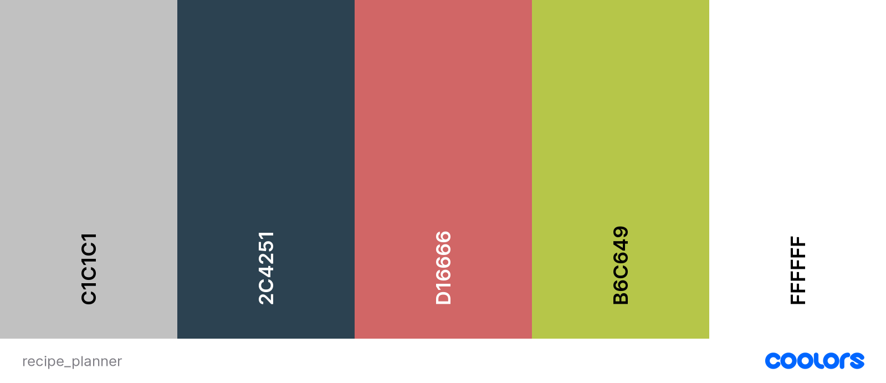

#  Armour Meal Planning - Project Outline
## Purpose
Create a application where user can search or browse by food item, meal type, ingredient, or generate a random recipe, review a list of recipes and save them to a meal plan based on date.
## Audience
Busy people who want to simplify meal planning. People who suffer from decision fatigue.
## Data Sources
- WebKnox Recipe API - [view source](https://rapidapi.com/webknox/api/recipe)
- Local Storage
## Initial Module List
- Search
- generateRandom
- apiConnect
- storage
- myRecipes
- myPlan
- editPlan

## Colors/Styling
- Color Palette - [view source](https://coolors.co/palette/052f5f-005377-06a77d-d5c67a-f1a208) 
- Fonts - [view source](https://fonts.google.com/share?selection.family=Exo%202:wght@300%7CNanum%20Gothic)
  - Headings: Exo 2
  - General: Nanum Gothic  

--- 
## Basic Timeline 
- #### week 1:
  - Complete planning
  - build html
  - basic styling
  - basic folder structure / module bones
- #### week 2:
  - fill in initial modules
  - build api connection
  - create storage functions
- #### week 3:
  - implement browse
  - implement search and edit
  - begin testing
- #### week 4:
  - finalize design
  - finalize functiionality
  - complete testing
  - deploy live

*Author: Alice Smith - Nov 12, 2022*  
*WDD 330 : Prof. Gedeborg*
